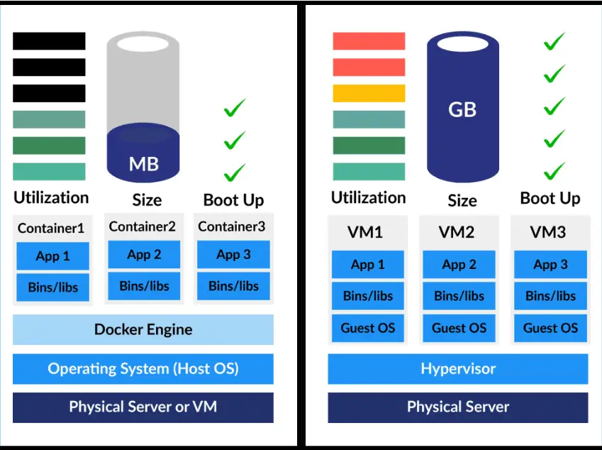

# 1.1 Infrastructure Evolution

Understanding how we got to containers requires looking at the evolution of infrastructure.

---

## Bare Metal

**Bare metal** refers to a physical computer system with no pre-installed operating system or applications. Only firmware such as BIOS or UEFI may be present.

### Characteristics

* No virtualization layer
* Full access to hardware resources
* High performance, low abstraction
* One OS per physical server

### Real-World Example: E-commerce Company (2000s)

```
Physical Setup:
┌─────────────────────┐
│  Web Server         │  Dell PowerEdge
│  Apache + PHP       │  2x CPU, 16GB RAM
└─────────────────────┘

┌─────────────────────┐
│  Database Server    │  HP ProLiant  
│  MySQL              │  4x CPU, 64GB RAM
└─────────────────────┘

┌─────────────────────┐
│  File Server        │  Dell PowerEdge
│  NFS Storage        │  2x CPU, 8GB RAM
└─────────────────────┘

Problems:
- Web server using only 20% CPU
- Database server at 60% capacity
- File server mostly idle
- Hardware underutilized
- High hardware costs
```

### Problems with Bare Metal

**Resource Waste**
- Most servers run at 10-30% utilization
- Can't easily share resources between applications

**Inflexibility**
- Need new hardware for each application
- Weeks to provision new servers
- Difficult to scale

**Maintenance**
- Physical hardware failures
- Manual OS installation and configuration
- No easy backup/restore

---

## Virtual Machines (VMs)

A **virtual machine** is a fully virtualized computer running its own operating system on top of a **hypervisor**.

### Architecture

```
┌─────────────────────────────────────────────┐
│           Physical Server                   │
│  ┌────────────┐  ┌────────────┐             │
│  │    VM 1    │  │    VM 2    │             │
│  │            │  │            │             │
│  │  App A     │  │  App B     │             │
│  │  Libraries │  │  Libraries │             │
│  │  Guest OS  │  │  Guest OS  │             │
│  │ (Ubuntu)   │  │ (CentOS)   │             │
│  └────────────┘  └────────────┘             │
│                                             │
│         Hypervisor (VMware/KVM)             │
│  ─────────────────────────────────────────  │
│            Host Operating System            │
│  ─────────────────────────────────────────  │
│            Physical Hardware                │
│         (CPU, RAM, Disk, Network)           │
└─────────────────────────────────────────────┘
```

### Characteristics

* Each VM includes a **full guest OS** (GBs of storage)
* **Strong isolation** - completely separate environments
* **Higher resource overhead** - each OS consumes RAM/CPU
* **Slower startup** - boots like a physical computer (minutes)

### Real-World Example: Netflix (2010s - Early AWS)

```
AWS EC2 Instance (VM):
┌─────────────────────────────────┐
│  VM: Web Server Instance        │
│                                 │
│  ┌──────────────────────────┐   │
│  │  Node.js Application     │   │
│  │  nginx                   │   │
│  └──────────────────────────┘   │
│                                 │
│  Ubuntu OS (2GB+ RAM)           │
│  - Kernel                       │
│  - System services              │
│  - Package managers             │
└─────────────────────────────────┘

Boot time: 45-90 seconds
Memory: ~2GB for OS + 500MB for app
Disk: 10GB for OS + 2GB for app

Can run different OS on each VM:
- VM1: Ubuntu for web servers
- VM2: CentOS for database
- VM3: Windows for legacy apps
```

### Benefits of VMs

**Better Resource Utilization**
- Multiple VMs on one physical server
- Server utilization: 60-80% (vs 10-30% bare metal)

**Isolation**
- Completely separate environments
- One VM crash doesn't affect others
- Different OS per VM

**Flexibility**
- Easy backup/restore (snapshots)
- Clone VMs quickly
- Move VMs between hosts

### Limitations of VMs

**Still Resource-Heavy**
- Each VM needs full OS (GBs of RAM, storage)
- Running 10 VMs = 10 operating systems

**Slow Startup**
- VM boot time: 45 seconds to 5 minutes
- Need to boot entire OS

**Portability Issues**
- VM images are large (10GB+)
- "Works on my machine" still exists
- Dependencies bundled with OS

---

## Containers

A **container** is a lightweight, isolated environment that packages an application with all its dependencies. Containers **share the host OS kernel** instead of running a full OS.

### Architecture

```
┌─────────────────────────────────────────────┐
│           Physical Server                   │
│  ┌────────┐ ┌────────┐ ┌────────┐           │
│  │Container│ │Container│ │Container│        │
│  │   1    │ │   2    │ │   3    │           │
│  │        │ │        │ │        │           │
│  │ App A  │ │ App B  │ │ App C  │           │
│  │ Libs   │ │ Libs   │ │ Libs   │           │
│  └────────┘ └────────┘ └────────┘           │
│                                             │
│    Container Runtime (Docker Engine)        │
│  ─────────────────────────────────────────  │
│         Host Operating System               │
│           (Shared Kernel)                   │
│  ─────────────────────────────────────────  │
│            Physical Hardware                │
└─────────────────────────────────────────────┘
```

### Key Technologies

**Linux Namespaces** - Provide isolation
- PID namespace: Process isolation
- NET namespace: Network isolation
- MNT namespace: Filesystem isolation
- IPC namespace: Inter-process communication
- UTS namespace: Hostname isolation
- USER namespace: User ID isolation

**Control Groups (cgroups)** - Resource limits
- CPU limits
- Memory limits
- Disk I/O limits
- Network bandwidth

### Characteristics

* **No guest OS** - share host kernel
* **Lightweight** - MBs instead of GBs
* **Fast startup** - seconds instead of minutes
* **Process-level isolation** - not as strong as VMs
* **Portable** - run anywhere Docker runs

### Real-World Example: Uber (Modern Microservices)

```
Single Physical Server Running Containers:
┌────────────────────────────────────────────┐
│  ┌──────────────┐  ┌──────────────┐        │
│  │ Container 1  │  │ Container 2  │        │
│  │              │  │              │        │
│  │ Ride Service │  │ User Service │        │
│  │ Node.js app  │  │ Java app     │        │
│  │ 100MB RAM    │  │ 150MB RAM    │        │
│  └──────────────┘  └──────────────┘        │
│                                            │
│  ┌──────────────┐  ┌──────────────┐        │
│  │ Container 3  │  │ Container 4  │        │
│  │              │  │              │        │
│  │ Payment API  │  │ Notification │        │
│  │ Python app   │  │ Go service   │        │
│  │ 80MB RAM     │  │ 50MB RAM     │        │
│  └──────────────┘  └──────────────┘        │
│                                            │
│       Docker Engine                        │
│       Ubuntu Linux (Shared Kernel)         │
└────────────────────────────────────────────┘

Start time: 2-5 seconds per container
Total Memory: 380MB for all apps
Can run 50+ containers on single server
```

---

## Virtual Machines vs Containers

```
┌──────────────────────────────┬──────────────────────────────┐
│      VIRTUAL MACHINES        │          CONTAINERS          │
│                              │                              │
│ ┌──────────────┐             │ ┌──────────────┐             │
│ │   VM App     │             │ │  Container   │             │
│ │   VM App     │             │ │  Container   │             │
│ │   VM App     │             │ │  Container   │             │
│ ├──────────────┤             │ ├──────────────┤             │
│ │ Guest OS     │             │ │   App + Libs │             │
│ ├──────────────┤             │ ├──────────────┤             │
│ │ Hypervisor   │             │ │ Container    │             │
│ │ (Type 1/2)   │             │ │ Runtime (*)  │             │
│ ├──────────────┤             │ ├──────────────┤             │
│ │ Host OS (*)  │             │ │ Host OS      │             │
│ │ (Type 2)     │             │ │ (Shared)     │             │
│ ├──────────────┤             │ ├──────────────┤             │
│ │ Hardware     │             │ │ Hardware     │             │
│ └──────────────┘             │ └──────────────┘             │
│                              │ * Docker Enine is a          │
│ * Host OS only in Type 2     │  a continer runtime          │
└──────────────────────────────┴──────────────────────────────┘
```

---

**Type 1 vs Type 2 Hypervisor:**

```
Type 1 (Bare Metal)            Type 2 (Hosted)
──────────────────            ──────────────────
┌──────────────┐              ┌──────────────┐
│   VM Apps    │              │   VM Apps    │
├──────────────┤              ├──────────────┤
│  Guest OS    │              │  Guest OS    │
├──────────────┤              ├──────────────┤
│ Hypervisor   │              │ Hypervisor   │
├──────────────┤              ├──────────────┤
│ Hardware     │              │ Host OS      │
└──────────────┘              ├──────────────┤
                              │ Hardware     │
                              └──────────────┘
```

---

* **VMs** virtualize **hardware** → each VM has its own OS
* **Containers** virtualize the **OS** → share the host kernel
* **Type 1 hypervisor** runs on hardware
* **Type 2 hypervisor** runs on a host OS

### Detailed Comparison


source: [k21academy](https://k21academy.com/wp-content/uploads/2020/11/Docker-and-Vm-blog-image_result-1.webp)

| Aspect | Virtual Machines | Containers |
|--------|------------------|------------|
| **What they virtualize** | Hardware | Application environment |
| **Operating System** | Each VM has full OS | Share host OS kernel |
| **Size** | GBs (typically 10-20GB) | MBs (typically 50-500MB) |
| **Boot time** | Minutes (45s - 5min) | Seconds (1-5s) |
| **Performance** | Slower (hypervisor overhead) | Near-native (minimal overhead) |
| **Isolation** | Strong (OS-level) | Moderate (process-level) |
| **Resource usage** | High (each OS consumes resources) | Low (share kernel) |
| **Density** | 10-100 VMs per host | 100-1000 containers per host |
| **Portability** | Medium (large image files) | Excellent (small, standardized) |
| **Security** | More secure (hardware isolation) | Less isolated (kernel shared) |
| **Use case** | Different OS needed, strong isolation | Microservices, CI/CD, scaling |

### Side-by-Side Example

#### Running 3 Web Applications

**Using VMs:**
```
Physical Server: 64GB RAM, 16 CPU cores

VM1: Ubuntu (2GB OS + 1GB app) = 3GB
VM2: Ubuntu (2GB OS + 1GB app) = 3GB  
VM3: Ubuntu (2GB OS + 1GB app) = 3GB
─────────────────────────────────────
Total: 9GB RAM
Can run ~21 VMs with same apps
```

**Using Containers:**
```
Physical Server: 64GB RAM, 16 CPU cores
Host OS: Ubuntu (2GB)

Container1: App only (100MB)
Container2: App only (100MB)
Container3: App only (100MB)
────────────────────────────
Total: 2.3GB RAM
Can run ~620 containers with same apps
```

### When to Use VMs

✅ **Use Virtual Machines When:**

1. **Different Operating Systems Needed**
   ```
   - VM1: Windows Server (legacy .NET app)
   - VM2: Ubuntu (Python app)
   - VM3: macOS (iOS build server)
   ```

2. **Strong Security Isolation Required**
   - Banking applications
   - Multi-tenant environments
   - Untrusted code execution

3. **Legacy Applications**
   - Old applications that need specific OS versions
   - Applications that modify kernel settings

4. **Compliance Requirements**
   - Regulations requiring OS-level isolation
   - Audit trails at hypervisor level

### When to Use Containers

✅ **Use Containers When:**

1. **Microservices Architecture**
   ```
   E-commerce Platform:
   - User Service (Node.js)
   - Product Service (Python)
   - Cart Service (Go)
   - Payment Service (Java)
   ```

2. **CI/CD Pipelines**
   ```
   Build → Test → Deploy
   Each stage runs in isolated container
   Consistent environments
   ```

3. **Cloud-Native Applications**
   - Need to scale horizontally
   - Frequent deployments
   - Resource efficiency critical

4. **Development Environments**
   - "Works on my machine" problem
   - Easy setup for new developers
   - Consistent dev/staging/prod

### Hybrid Approach

Many organizations use **both**:

```
┌────────────────────────────────────────┐
│  AWS EC2 Instance (VM)                 │
│                                        │
│  ┌──────────────────────────────────┐  │
│  │  Docker Containers               │  │
│  │                                  │  │
│  │  ┌────┐ ┌────┐ ┌────┐ ┌────┐     │  │
│  │  │ C1 │ │ C2 │ │ C3 │ │ C4 │     │  │
│  │  └────┘ └────┘ └────┘ └────┘     │  │
│  └──────────────────────────────────┘  │
│                                        │
│  Ubuntu OS                             │
└────────────────────────────────────────┘

Benefits:
- VM provides OS-level isolation
- Containers provide app-level density
- Best of both worlds
```

### Real-World Company Evolution

**Spotify's Infrastructure Journey:**

```
2010: Bare Metal
├── 100 physical servers
├── Low utilization (15-25%)
└── Manual provisioning (weeks)

2012: Virtual Machines
├── 20 physical servers
├── 300 VMs
├── Better utilization (60-70%)
└── Faster provisioning (hours)

2015: Containers + VMs
├── 20 physical servers
├── 100 VMs
├── 2000+ containers
├── High utilization (80-90%)
└── Instant provisioning (seconds)

Result:
- 10x more applications per server
- 100x faster deployment
- 80% cost reduction
```

---

## Practice Questions

<details>
<summary><strong>View Questions</strong></summary>

### Fill in the Blanks

1. Bare metal refers to a physical computer with no pre-installed __________ or applications.
2. Virtual machines virtualize __________, while containers virtualize __________.
3. Containers share the host __________ kernel instead of running a full OS.
4. A typical VM boots in __________ to __________ minutes, while containers start in __________.
5. The two main Linux kernel features enabling containers are __________ and __________.
6. VMs provide __________ isolation, while containers provide __________ level isolation.

### True/False

1. ⬜ Each virtual machine includes its own full operating system
2. ⬜ Containers are more isolated than virtual machines
3. ⬜ Containers can run Windows applications on a Linux host
4. ⬜ Virtual machines typically use more RAM than containers
5. ⬜ You can run different operating systems on different containers on the same host
6. ⬜ Containers are faster to start than virtual machines
7. ⬜ A single physical server can run more containers than VMs
8. ⬜ VMs are better for microservices architecture than containers

### Multiple Choice

1. What is the primary reason containers are faster to start than VMs?
   - A) They use less CPU
   - B) They don't need to boot a full operating system
   - C) They have smaller applications
   - D) They use better compression

2. Which technology provides process isolation in containers?
   - A) Hypervisor
   - B) cgroups
   - C) Namespaces
   - D) Virtual CPU

3. What is the typical size of a container image?
   - A) KBs
   - B) MBs
   - C) GBs
   - D) TBs

4. Which scenario is BEST suited for virtual machines?
   - A) Running 100 microservices
   - B) CI/CD pipeline
   - C) Running Windows and Linux apps on same host
   - D) Deploying quick updates

5. What does cgroups control in containers?
   - A) Network isolation
   - B) Process isolation
   - C) Resource limits (CPU, memory)
   - D) Filesystem isolation

---

### Answers

<details>
<summary><strong>View Answers</strong></summary>

**Fill in the Blanks:**
1. operating system
2. hardware, applications (or application environment)
3. OS (or operating system)
4. 45 seconds (or 1), 5, seconds (or 1-5 seconds)
5. namespaces, cgroups (order doesn't matter)
6. OS-level (or hardware-level), process

**True/False:**
1. ✅ True - Each VM has a complete guest OS
2. ❌ False - VMs provide stronger isolation than containers
3. ❌ False - Containers share the host kernel, so Windows containers need Windows host
4. ✅ True - VMs include full OS which uses more RAM
5. ❌ False - Containers share the host kernel, so same OS only
6. ✅ True - Containers start in seconds vs minutes for VMs
7. ✅ True - Due to lower overhead, more containers fit per server
8. ❌ False - Containers are better for microservices (lightweight, fast)

**Multiple Choice:**
1. **B** - They don't need to boot a full operating system
2. **C** - Namespaces (provide isolation)
3. **B** - MBs (typically 50-500MB)
4. **C** - Running Windows and Linux apps on same host (need different OS kernels)
5. **C** - Resource limits (CPU, memory) - cgroups control resource allocation

</details>

</details>

---

## Interview Questions

<details>
<summary><strong>View Questions</strong></summary>

### Question 1: Explain the fundamental difference between VMs and containers

<details>
<summary><strong>View Answer</strong></summary>

**Key Points to Cover:**

Virtual Machines virtualize **hardware** and run a complete OS:
- Include full guest operating system (kernel, system libraries, utilities)
- Hypervisor sits between VMs and hardware
- Each VM is completely isolated with its own kernel
- Heavy (GBs) and slow to start (minutes)

Containers virtualize the **application environment**:
- Share the host OS kernel
- Container runtime (like Docker) provides isolation using namespaces and cgroups
- Only package application and dependencies
- Lightweight (MBs) and fast to start (seconds)

**Analogy:**
- VM = Owning separate houses (each has its own foundation, plumbing, electrical)
- Container = Apartments in a building (share foundation and utilities, separate living spaces)

**Example:**
```
VM:                      Container:
┌─────────────┐         ┌─────────────┐
│ Application │         │ Application │
│ Libraries   │         │ Libraries   │
│ Guest OS    │  ←───   │ (no OS!)    │
│ (Full Linux)│         └─────────────┘
└─────────────┘         Shares host kernel
```

</details>

### Question 2: Why can't you run Windows containers on a Linux host?

<details>
<summary><strong>View Answer</strong></summary>

**Answer:**

Containers **share the host operating system kernel**. The kernel provides system calls that applications need to function.

Windows applications make Windows system calls, and Linux applications make Linux system calls. These are fundamentally incompatible.

**Technical Explanation:**
```
Linux Host Kernel → Only understands Linux syscalls
Windows Container App → Makes Windows syscalls
❌ Kernel can't translate/handle Windows syscalls
```

**However, you CAN:**
- Run Windows containers on Windows host
- Run Linux containers on Linux host
- Run Windows VM on Linux host (VM has its own kernel)
- Run Linux VM on Windows host (VM has its own kernel)

**With VMs:**
```
Linux Host
├── Hypervisor
└── Windows VM (has Windows kernel)
    └── Windows Container ✅ Works!
```

The VM provides the Windows kernel that Windows containers need.

</details>

### Question 3: When would you choose VMs over containers?

<details>
<summary><strong>View Answer</strong></summary>

**Choose VMs when you need:**

**1. Different Operating Systems**
```
Example: Running legacy systems
- Windows Server (for .NET Framework apps)
- Ubuntu 18.04 (for Python 2.7 apps)
- CentOS 7 (for Java apps)
All need different kernels → Use VMs
```

**2. Maximum Security Isolation**
```
Multi-tenant SaaS platform:
- Customer A's code
- Customer B's code
- Customer C's code

VM isolation prevents:
- Kernel exploits affecting other tenants
- Resource exhaustion attacks
- Data leakage between tenants
```

**3. Legacy Applications**
```
Banking system from 2005:
- Requires specific kernel version
- Modifies kernel parameters
- Uses deprecated system libraries
→ Needs full OS control = VM
```

**4. Compliance Requirements**
```
HIPAA/PCI-DSS compliance:
- Requires OS-level isolation
- Needs separate audit trails
- Kernel-level security controls
→ VMs provide this isolation
```

**5. Resource Guarantees**
```
Database server:
- Needs dedicated CPU cores
- Requires guaranteed memory
- Can't tolerate "noisy neighbors"
→ VM provides hard resource isolation
```

**Example Scenario:**
A hospital runs:
- Patient records system (HIPAA compliance) → VM
- Billing system (PCI-DSS) → VM  
- Internal tools (microservices) → Containers

VMs for regulated workloads, containers for everything else.

</details>

### Question 4: A company is running 20 web applications on 20 physical servers with 15% average CPU utilization. How would you optimize this?

<details>
<summary><strong>View Answer</strong></summary>

**Analysis:**

Current state:
- 20 servers × 15% utilization = massive waste
- High hardware costs
- High power/cooling costs
- Difficult to manage

**Solution Approach:**

**Phase 1: Virtualization (Short-term)**
```
Consolidate to 4 physical servers:
Server 1: 5 VMs (web apps 1-5)
Server 2: 5 VMs (web apps 6-10)
Server 3: 5 VMs (web apps 11-15)
Server 4: 5 VMs (web apps 16-20)

Benefits:
- 16 servers decommissioned (80% reduction)
- 60-70% CPU utilization per host
- Easy backup/restore with snapshots
- Can still run different OS versions

Limitations:
- Still running 20 operating systems
- 2-3GB RAM per VM for OS alone
```

**Phase 2: Containerization (Long-term)**
```
Further consolidate to 2 physical servers:
Server 1: 10 containers (apps 1-10)
Server 2: 10 containers (apps 11-20)

Benefits:
- 18 servers decommissioned (90% reduction)
- 80% CPU utilization per host
- Each app uses only 100-200MB RAM
- Fast deployment (seconds)
- Easy horizontal scaling

Result:
- Cost: $500K/year → $50K/year (90% savings)
- Deployment time: 1 week → 5 minutes
- Scalability: Manual → Automatic
```

**Real Example - Shopify:**
```
Before (2014):
- 500 bare metal servers
- 20% average utilization
- $5M/year infrastructure cost

After containerization (2016):
- 100 servers with containers
- 75% utilization
- $1M/year infrastructure cost
- 10x faster deployments
```

</details>

### Question 5: Explain how namespaces and cgroups work together to create container isolation

<details>
<summary><strong>View Answer</strong></summary>

**Namespaces provide ISOLATION, cgroups provide LIMITS**

**Namespaces** = "What you can SEE"
- Create isolated views of system resources
- Each container thinks it's alone on the system

**cgroups** = "How much you can USE"
- Limit resource consumption
- Prevent one container from starving others

**Detailed Example:**

```
Host System:
- 4 CPU cores
- 16GB RAM
- 100 processes running

Container A with namespaces:
PID namespace:
  ├── Sees only its own processes
  ├── Process 1 inside = Process 5432 on host
  └── Can't see/kill host or other container processes

NET namespace:
  ├── Own network stack
  ├── Own IP address (172.17.0.2)
  └── Can't see other containers' network traffic

MNT namespace:
  ├── Own filesystem view
  ├── Sees /app as root
  └── Can't access host's /home

Container A with cgroups:
CPU:
  └── Limited to 1 CPU core (25% of total)
Memory:
  └── Limited to 2GB (12.5% of total)
Disk I/O:
  └── Limited to 100MB/s
```

**Working Together:**

```
User runs: docker run --cpus=2 --memory=4g nginx

Docker creates:
1. Namespaces (Isolation):
   - PID namespace → nginx can't see host processes
   - NET namespace → nginx gets own network
   - MNT namespace → nginx sees own filesystem

2. cgroups (Limits):
   - CPU cgroup → max 2 cores
   - Memory cgroup → max 4GB
   - If exceeds 4GB → container killed (OOM)

Result:
nginx runs in isolated "bubble" with resource guarantees
```

**Real-World Analogy:**

Namespaces = Hotel room walls
- You can't see into other rooms
- Each room appears private

cgroups = Room service limits
- You can order max $100/day
- Can't use all hotel resources
- Prevents one guest from monopolizing

**Interview Answer Flow:**
1. State the purpose: "Namespaces provide isolation, cgroups provide resource limits"
2. Explain each: Show what each technology does
3. Give example: Demonstrate them working together
4. Real-world impact: "This enables running 100s of containers safely on one host"

</details>

### Question 6: What happens if you start 100 containers but don't set memory limits?

<details>
<summary><strong>View Answer</strong></summary>

**Without memory limits:**

```
Host: 16GB RAM total

Container 1: Uses 200MB
Container 2: Uses 150MB
...
Container 50: Uses 300MB
────────────────────────
Total: 15GB used

Container 51 starts...
Uses 500MB → Host at 15.5GB

Container 52 starts...
Needs 600MB → Only 500MB available!
```

**What Happens:**

**1. Host Memory Exhaustion**
```
Symptoms:
- System slowdown
- Swap thrashing (using disk as RAM)
- Applications freeze
- SSH connections drop
- System becomes unresponsive
```

**2. OOM Killer Activates**
```
Linux Out-Of-Memory Killer:
1. Detects memory pressure
2. Calculates which process to kill
3. Typically kills highest memory consumer
4. May kill random containers unpredictably

Result:
- Container X gets killed randomly
- Application crashes
- No graceful shutdown
- Data loss possible
```

**3. Noisy Neighbor Problem**
```
Container A (normal): Uses 100MB
Container B (memory leak): Uses 14GB
Container C (normal): Killed by OOM

Container B starves everyone else!
```

**Best Practice - Set Limits:**

```bash
# Set memory limit per container
docker run -m 512m nginx

# Set memory + swap limit
docker run -m 512m --memory-swap 1g nginx

# In docker-compose.yml
services:
  web:
    image: nginx
    deploy:
      resources:
        limits:
          memory: 512M
        reservations:
          memory: 256M
```

**Real Incident - Reddit (2018):**
```
Problem:
- Deployed containerized app
- No memory limits set
- Memory leak in one service
- Consumed 60GB RAM
- Killed database containers
- 4 hour outage

Fix:
- Set memory limits on all containers
- Implemented memory monitoring
- Auto-restart on OOM
- Never happened again
```

**Answer Summary:**
"Without memory limits, containers can consume all available RAM, triggering the OOM killer which randomly terminates processes. This causes unpredictable crashes and poor performance. Always set memory limits in production to guarantee resources and prevent cascading failures."

</details>

</details>

---

[Next: 1.2 Why Containers? →](../01-fundamentals/02-why-containers.md)