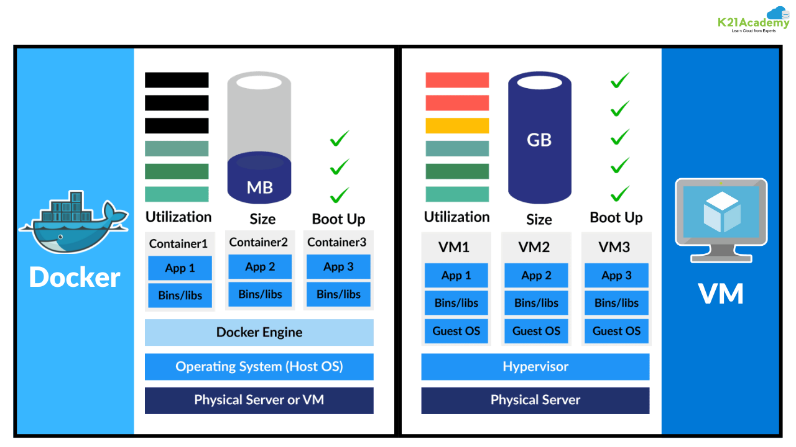

# Docker

## Bare Metal

**Bare metal** refers to a physical computer system with no pre-installed operating system or applications. Only firmware such as BIOS or UEFI may be present.

**Key points:**

* No virtualization layer
* Full access to hardware resources
* High performance, low abstraction

---

## Virtual Machines (VMs)

A **virtual machine (VM)** is a fully virtualized computer running its own operating system on top of a **hypervisor**.

**Characteristics:**

* Each VM includes a full guest OS
* Strong isolation
* Higher resource overhead
* Slower startup compared to containers

**Example:**

* One physical server running Linux
* Multiple VMs running Linux and Windows

---

## Containers

A **container** is a lightweight, isolated environment that packages an application with all its dependencies. Containers share the host OS kernel instead of running a full OS.

**Key technologies used:**

* Linux namespaces (process, network, filesystem isolation)
* cgroups (resource limits)

**Why containers are fast:**

* No guest OS
* Minimal overhead

---

## Virtual Machines vs Containers



source: [k21academy](https://k21academy.com/wp-content/uploads/2020/11/Docker-and-Vm-blog-image_result-1.webp)

<details>

<summary><strong>Details >></strong></summary>

### High-Level Difference

| Virtual Machines           | Containers                   |
| -------------------------- | ---------------------------- |
| Virtualize **hardware**    | Virtualize **applications**  |
| Each VM has its **own OS** | Share the **host OS kernel** |
| Heavyweight                | Lightweight                  |
| Slower to start            | Start in seconds             |
| Strong isolation           | Process-level isolation      |

---

### Architecture Comparison

#### Virtual Machines

```
Applications
Guest OS
-----------
Hypervisor
-----------
Host OS
-----------
Hardware
```

* Each VM runs a **full operating system**
* Hypervisor manages hardware allocation
* Higher memory and CPU usage

---

#### Containers

```
Applications
-----------
Container Runtime (Docker)
-----------
Host OS Kernel
-----------
Hardware
```

* Containers **do not include an OS**
* Share the host kernel
* Much lower overhead

---

### Resource Usage

| Feature      | Virtual Machine | Container |
| ------------ | --------------- | --------- |
| Disk size    | GBs             | MBs       |
| Memory usage | High            | Low       |
| CPU overhead | High            | Minimal   |
| Boot time    | Minutes         | Seconds   |

---

### Isolation & Security

| Aspect            | Virtual Machine   | Container                |
| ----------------- | ----------------- | ------------------------ |
| Isolation         | Strong (OS-level) | Moderate (process-level) |
| Kernel            | Separate per VM   | Shared                   |
| Security boundary | Hardware-level    | OS-level                 |

> VMs are better for **strong isolation**, containers are better for **speed and density**.

---

### Portability

|                             | Virtual Machine | Container |
| --------------------------- | --------------- | --------- |
| Cross-platform              | Limited         | Excellent |
| Environment consistency     | Medium          | Very high |
| “Works on my machine” issue | Possible        | Rare      |

Containers package the app and dependencies together, making them highly portable.

---

### Scaling & Deployment

#### Virtual Machines

* Scaling means **creating new VMs**
* Slow provisioning
* Less efficient for microservices

#### Containers

* Scale by **spawning new containers**
* Very fast
* Ideal for microservices & cloud-native apps

---

### Use Cases

#### Use Virtual Machines When:

* You need **different operating systems**
* Strong security isolation is required
* Running legacy applications
* Compliance requires OS-level isolation

#### Use Containers When:

* Building **microservices**
* CI/CD pipelines
* Cloud-native applications
* Fast startup and scaling are important

---

### Real-World Example

#### VM Example

Running:

* Windows Server VM
* Ubuntu VM
* CentOS VM
  All on the same physical machine

#### Container Example

Running:

* Node.js API
* Redis
* PostgreSQL
  All sharing the same Linux kernel

</details>


## Why Containers Are Useful

<details>
<summary>View contents</summary>

### Scenario 1: “Works on My Machine”

Containers package the application **with its exact dependencies**, ensuring consistent behavior across development, testing, and production environments.

---

### Scenario 2: Isolated Environments

Each container runs independently:

* No dependency conflicts
* Safe experimentation
* Easy cleanup

---

### Scenario 3: Development with Multiple Services

Example application dependencies:

* PostgreSQL
* MongoDB
* Redis

Containers allow each service to run independently without polluting the host system.

---

### Scenario 4: Scaling & Reliability

With container orchestration (e.g., Kubernetes):

* Failed containers are restarted automatically
* Traffic is load-balanced across replicas
* Horizontal scaling becomes simple

---

</details>

## What Is Docker?

**Docker** is a set of tools that enables developers to:

* Build container images
* Run containers
* Share images via registries

**In short:**

> Docker helps you package, ship, and run applications consistently.

---

## Docker Image vs Docker Container

| Docker Image   | Docker Container  |
| -------------- | ----------------- |
| Blueprint      | Running instance  |
| Immutable      | Mutable (runtime) |
| Like a program | Like a process    |

**Example:**

```sh
docker run nginx
```

* `nginx` → image
* Running nginx instance → container

---

## Docker Engine

The **Docker Engine** is the core component of Docker that allows you to run and manage containers. It is responsible for creating, running, and managing containers on your system.

Docker Engine runs containers using Linux namespaces for isolation and cgroups for resource control, while Docker CLI communicates with Docker Daemon through REST API.

<details>
<summary>View contents</summary>

### Docker Engine = 3 Main Parts

1. **Docker CLI (Client)**
2. **Docker Daemon (Server)**
3. **Docker REST API (Communication Layer)**

## 1. Docker CLI (Client)

The **Docker CLI** is the command-line tool we use to interact with Docker.

Examples:

```bash
docker run ubuntu
docker ps
docker build .
```

### What Docker CLI does:

* Takes user commands
* Converts them into **REST API requests**
* Sends them to the **Docker Daemon**

**Important:**
Docker CLI **does not run containers**.
It only **talks** to the Docker Daemon.

---

## 2. Docker Daemon (dockerd)

The **Docker Daemon** is the **brain** of Docker.

### What Docker Daemon does:

* Creates containers
* Runs containers
* Stops containers
* Manages images, networks, volumes
* Uses **Linux Kernel features**

  * **Namespaces** → isolation
  * **cgroups** → resource limits (CPU, memory)

The daemon runs in the background as:

```bash
dockerd
```

By default, it listens on:

```
unix:///var/run/docker.sock
```

---

## 3. Docker REST API

The **Docker REST API** is how communication happens.

### Flow:

* Docker CLI → sends **HTTP request**
* Docker Daemon → receives & processes it

Example API action:

```
POST /containers/create
```

This means:

* Docker CLI = API Client
* Docker Daemon = API Server

---

## Docker Engine Architecture Diagram

```
+-------------+
| Docker CLI  |
| (docker)    |
+------+------+
       |
       | REST API (HTTP)
       |
+------+------+
| Docker      |
| Daemon      |
| (dockerd)   |
+------+------+
       |
       | Linux Kernel
       |
+------+--------------------+
| Namespaces | cgroups      |
| (isolate)  | (limit)      |
+---------------------------+
```

---

## Connecting to Remote Docker Engine

### Command:

```bash
docker -H=remote-docker-engine:2375
```

### What it means:

* `-H` → Host
* `2375` → Docker daemon TCP port
* Docker CLI connects to a **remote Docker Daemon**

📌 Instead of local socket:

```
/var/run/docker.sock
```

It uses:

```
tcp://remote-docker-engine:2375
```

⚠️ **Note:**
Port **2375 is insecure** unless protected with TLS.

---

Two critical concepts within Docker that allow containers to function efficiently and securely are:

1. **Namespaces**
2. **Control Groups (cgroups)**

### **1. Docker Namespaces**

A **namespace** in Docker is a feature of the Linux kernel that isolates different processes, networks, and other system resources so that they do not interfere with each other. When you run a Docker container, it is given its own namespaces that isolate it from other containers and the host system.

Docker uses several types of namespaces to isolate containers:

* **PID Namespace**: Isolates process IDs, meaning each container thinks it has its own set of processes (e.g., process ID 1 in the container).

* **NET Namespace**: Isolates network interfaces, meaning each container gets its own virtual network stack, including IP addresses, ports, and routing tables.

* **MNT Namespace**: Isolates mount points (filesystems), so each container has its own file system structure, independent of the host system or other containers.

* **UTS Namespace**: Isolates hostname and domain name settings, so each container has its own hostname and can set up domain names.

* **IPC Namespace**: Isolates inter-process communication (IPC) resources, such as message queues, semaphores, and shared memory.

* **USER Namespace**: Isolates user and group IDs, so a process inside a container might have a different user ID (UID) compared to the same process outside the container.

---

### **Namespace Diagram**

Let me draw a simple diagram to show how namespaces work:

```
+--------------------------+
|    Host System           | 
|                          | 
|  +--------------------+  |
|  |  Container 1       |  |
|  |  - PID Namespace   |  |
|  |  - NET Namespace   |  |
|  |  - MNT Namespace   |  |
|  |  - IPC Namespace   |  |
|  |  - USER Namespace  |  |
|  +--------------------+  |
|                          |
|  +--------------------+  |
|  |  Container 2       |  |
|  |  - PID Namespace   |  |
|  |  - NET Namespace   |  |
|  |  - MNT Namespace   |  |
|  |  - IPC Namespace   |  |
|  |  - USER Namespace  |  |
|  +--------------------+  |
+--------------------------+
```

* Each container has its own isolated namespaces (PID, NET, etc.).
* The containers are independent, even though they run on the same physical host.

---

### **2. Control Groups (cgroups)**

**Cgroups** (short for "Control Groups") are another feature of the Linux kernel that allow Docker to allocate and limit system resources (CPU, memory, disk I/O, etc.) to containers.

With cgroups, Docker can:

* Limit the amount of CPU and memory a container can use.
* Prevent containers from using more resources than they are allowed.
* Monitor the usage of resources by containers.
* Set priority levels to control how containers share resources.

For example, Docker can use cgroups to make sure that Container 1 does not use more than 2GB of RAM, even if it tries.

---

### **Cgroups Diagram**

Here’s a simple diagram to show how cgroups work:

```
+----------------------------+
|         Host System         |
|   +----------------------+  |
|   |  Cgroup (CPU, Memory) |  |
|   |  for Container 1      |  |
|   +----------------------+  |
|   +----------------------+  |
|   |  Cgroup (CPU, Memory) |  |
|   |  for Container 2      |  |
|   +----------------------+  |
+----------------------------+
```

* The host system uses cgroups to allocate resources.
* Each container gets its own cgroup to limit and monitor CPU and memory usage.

---

### CPU Limit Example

```bash
docker run --cpu=.5 ubuntu
```

### Explanation:

* Container can use **50% of one CPU core**
* Enforced using **cgroups**
* Prevents container from overusing CPU

📌 Internally:

```
cgroups → CPU quota = 50%
```

---

### Memory Limit Example

```bash
docker run --memory=100m ubuntu
```

### Explanation:

* Container can use **maximum 100 MB RAM**
* Controlled using **memory cgroups**
* If limit exceeded → container may be stopped

📌 Internally:

```
cgroups → memory limit = 100MB
```

---

### **How Namespaces and Cgroups Work Together**

* **Namespaces** provide isolation for the container, making sure that it operates as if it has its own system.
* **Cgroups** manage and limit the resources available to each container, ensuring one container doesn’t starve others or take too many resources.

In this way, Docker achieves efficient resource utilization while maintaining the isolation and security of containers.

---

### **Real-World Analogy**

Think of the **namespace** as a room inside a house. Each room has its own walls, door, and windows (isolated environment). You can't see or interact with things outside your room unless you specifically open the door.

Now, imagine that **cgroups** are like the amount of space and energy allowed in the room. Cgroups make sure that no room gets too crowded or uses too much energy (CPU, memory, etc.)—there’s a limit to how much each room can use.

---

## How Docker Engine Executes `docker run`

### Step-by-Step Flow:

1. User runs `docker run`
2. Docker CLI sends REST API request
3. Docker Daemon receives request
4. Daemon:

   * Creates **namespaces** (PID, NET, MNT, etc.)
   * Applies **cgroups** (CPU, memory)
5. Container starts running

---

</details>

## Basic Docker Commands

```sh
docker --version
docker version
```

---

## Docker Images

<details>
<summary>View contents</summary>

### Build an Image

```sh
# docker build -t image_name path_of_dockerfile
docker build -t myapp .
```

### List Images

```sh
docker image ls

# Old way
docker images
```

### Pull an image from docker repository

```sh
# docker pull registry_omain/image_name:tag
docker pull private-registry-domain/myapp:1.0

# if we don't give repository domain,
# it will pull from docker hub by default
docker pull node:lts
```

### Push Image

```sh
# docker push registry_omain/image_name:tag
docker push private-registry-domain/myapp:1.0

# if we don't give repository domain,
# it will push to docker hub by default
docker pull myapp:lts
```

### Remove Image

```sh
docker image rm myapp:1.0 # docker image rm image_name/image_id

# old way
docker rmi myapp:1.0
```

### Rename image name

```sh
# docker tag old_image_name new_image_name
docker tag myapp:1.0 myapp:latest
```

### Load an image from a tar archive

```sh
# docker load -i name.tar
docker load -i myapp.tar
```

### Remove unused images

```sh
docker image prune
```

---

</details>

## Docker Containers

<details>
<summary>View contents</summary>

Container Information

| CONTAINER ID | IMAGE | COMMAND                | CREATED       | STATUS       | PORTS                  | NAMES         |
| ------------ | ----- | ---------------------- | ------------- | ------------ | ---------------------- | ------------- |
| d58a6b05e3b9 | redis | "docker-entrypoint.s…" | 3 minutes ago | Up 3 minutes | 0.0.0.0:6000->6379/tcp | boring_agnesi |

### Run a Container

```sh
# run a container in attached mode with a random name
docker run myapp:1.0

# run a container in detached mode with a random name
docker run -d myapp:1.0

# run a container with the provided name
# docker run --name container_name image_name:tag
docker run --name myapp myapp:1.0

# run a container with binding port
# docker run -p host_port:container_port image_name:tag
docker run -p 8080:8081 myapp:1.0

docker run -d -p 8080:8081 --name myapp myapp:1.0
```

### List Containers

```sh
# list all running containers
docker container ls # OR, docker ps

# list all containers including stopped ones
docker container ls -a # OR, docker ps -a
```

### Stop / Start

```sh
# docker stop container_name/container_id
docker stop myapp

# docker start container_name/container_id
docker start myapp
```

### Execute command in running container

> It is useful for debugging, troubleshooting, or when we need to run commands directly inside the container. Once the container is running in interactive mode, we can execute commands within the container just as if we were inside a regular terminal.

```sh
# execute a specific command (sh or bash) in running container
# docker exec -it container_name/container_id sh/bash
docker exec -it myapp sh # OR, docker exec -it myapp /bin/sh
```

### Run a container in interactive mode

> It is useful for debugging, troubleshooting, or when we need to run commands directly inside the container. Once the container is running in interactive mode, we can execute commands within the container just as if we were inside a regular terminal. 

```sh
# run container in interactive mode with default command
# -i means interactive and -t means terminal
docker run -it myapp

# run container in interactive mode with overriding the default command with "sh" or "bash"
dcoker run -it myapp bash
```

type `exit` or `Ctrl + D`: To exit the interactive mode and stoping the container. \
`Ctrl + P` followed by `Ctrl + Q`: To exit the interactive mode without stopping the container.

### Remove a container

```sh
# remove a stopped container
# docker container rm container_name/container_id
docker container rm myapp # OR, docker rm myapp

# remove a running container forcefully
docker container rm -f myapp # docker rm -f myapp
```

### View container logs

> It is useful for debugging, and troubleshooting.

```sh
docker logs myapp
```

### Pause/unpause a running container

```sh
docker pause myapp

docker unpause myapp
```

---

</details>

## Docker Volumes

Docker containers use an **isolated filesystem**.
By default, **any data written inside a container is lost** when the container is stopped, removed, or recreated.

To solve this problem, Docker provides **volumes**.

<details>
<summary>View contents</summary>

### What Is a Docker Volume?

A **Docker volume** is a way to **store data outside the container’s filesystem** so that the data **persists even after the container is deleted**.

In simple terms:

> A Docker volume connects a directory inside a container to a directory on the host machine (or to Docker-managed storage).

---

### Why Volumes Are Important

Without volumes:

* Container is deleted → data is lost

With volumes:

* Container is deleted → **data remains**
* New container can reuse the same data

---

### How Docker Volumes Work

* The container writes data to a directory
* That directory is **mounted** to a location outside the container
* Docker keeps this data independent from the container lifecycle

```
Container filesystem  --->  Volume (persistent storage)
```

---

### Data Synchronization

* When data changes **inside the container**, it is immediately reflected in the volume
* When data changes **in the volume**, the container sees the updated data

This works because both paths point to the **same storage location**.

---

### Simple Example

```sh
docker run -v my-data:/var/lib/mysql mysql
```

* `/var/lib/mysql` → path inside the container
* `my-data` → Docker-managed persistent volume
* Database data stays safe even if the container is removed

---

> **Containers are temporary. Volumes are permanent.**

Use Docker volumes whenever your application needs to store:

* Databases
* User uploads
* Logs
* Configuration data

### Create a named volume

```sh
docker volume create volume_name
```

### List all volumes

```sh
docker volume ls
```

### Remove a volume

```sh
docker volume rm volume_name
```

### Run a container with a volume

```sh
# This is called host vaolumes
# Here, user defines the host file system path
# -v /path/in/host:/path/in/container
docker run -v /home/app-data:/var/lib/mysql/data myapp

# This is called annonymous vaolumes
# Here, docker defines the host file system path with a random name
# -v /path/in/container
docker run -v /var/lib/mysql/data myapp

# This is called named vaolumes
# Here, docker defines the host file system path with the provided name
# -v volume_name:/path/in/container
docker run -v my-data:/var/lib/mysql/data myapp
```

### Copy files between a contain and a volume

```sh
# copy from container to volume
docker cp container_name:/path/to/source/file_or_directory /path/in/volume

# copy from volume to container
docker cp /path/in/volume container_name:/path/in/container
```

---

</details>

## Docker Network

By default, Docker containers are **isolated from each other** and from the outside world.
They cannot communicate unless Docker explicitly allows it.

To control **how containers talk to each other and to external systems**, Docker provides **networks**.

<details>
<summary>View contents</summary>

### What Is a Docker Network?

A **Docker network** is a virtual network that connects containers together and controls:

* Which containers can communicate
* How they discover each other
* How traffic flows in and out of containers

In simple terms:

> A Docker network acts like a **private LAN** for containers.

---

### Why Docker Networks Are Important

Without Docker networks:

* Containers cannot easily talk to each other
* You must use IP addresses (which change)
* Communication becomes fragile

With Docker networks:

* Containers can communicate using **container names**
* Network isolation improves security
* Multi-container applications become manageable

---

### How Docker Networks Work

* Docker creates a **virtual network layer**
* Each container gets:

  * A virtual network interface
  * An internal IP address
* Docker provides built-in **DNS**, so containers can find each other by name

```
[ web ] ----\
             ---> Docker Network ---> Internet
[ db  ] ----/
```

---

### Container-to-Container Communication

If two containers are on the **same Docker network**:

```sh
docker network create app-network

docker run --name db --network app-network postgres
docker run --name api --network app-network my-api
```

Inside `api`, you can connect to the database using:

```
db:5432
```

No IP addresses needed.

---

### Container-to-Host / Internet Communication

* Containers can access the internet by default
* To access a container from the host or browser, **ports must be published**

```sh
docker run -p 8080:80 nginx
```

* Host port `8080` → Container port `80`

---

### Types of Docker Networks (Common Ones)

| Network Type | Purpose                 | When to Use                     |
| ------------ | ----------------------- | ------------------------------- |
| bridge       | Default private network | Most local development          |
| host         | Share host network      | High performance, low isolation |
| none         | No networking           | Maximum isolation               |
| overlay      | Multi-host networking   | Docker Swarm / Kubernetes       |

---

### Network Isolation

* Containers on **different networks cannot communicate**
* This improves security by limiting access

Example:

* `frontend` network → web app
* `backend` network → database

Only containers connected to both can act as bridges.

---

### Simple Mental Model

> **Docker Network = Virtual switch + DNS for containers**

---

### Key Takeaway

* Containers communicate through Docker networks
* Names are more important than IPs
* Networks provide isolation, discovery, and control

---

## List All Docker Networks

```sh
docker network ls
```

### What it shows:

* Network name
* Network ID
* Driver (bridge, host, none)
* Scope

📌 Example output:

```
bridge
host
none
```

---

## Create a User-Defined Bridge Network

```sh
docker network create network_name
```

### Why user-defined bridge?

* Automatic **DNS resolution**
* Containers can talk using **container names**
* Better isolation than default bridge

---

## Create a Bridge Network with Custom Subnet & Gateway

```sh
docker network create \
  --driver bridge \
  --subnet 182.18.0.0/24 \
  --gateway 182.18.0.1 \
  wp-mysql-network
```

### Explanation:

* `--driver bridge` → bridge network
* `--subnet` → custom IP range
* `--gateway` → network gateway
* `wp-mysql-network` → network name

📌 Each container in this network gets an IP like:

```
182.18.0.x
```

---

## Inspect a Network

```sh
docker network inspect bridge
```

OR

```sh
docker network inspect wp-mysql-network
```

### What you can see:

* Subnet & gateway
* Connected containers
* IP addresses
* Network driver

📌 Very useful for debugging networking issues.

---

## Run a Container in a Specific Network

```sh
docker run --network network_name image_name
```

OR (short form):

```sh
docker run -net network_name image_name
```

### Example:

```sh
docker run --network wp-mysql-network alpine
```

---

## Run a Container with **No Network Access**

```sh
docker run --name alpine-2 --network=none alpine
```

### What this means:

* Container has **no network**
* No internet
* No container communication

📌 Used for:

* Security testing
* Isolated workloads

---

## Connect an Existing Container to a Network

```sh
docker network connect network_name container_name
```

### Example:

```sh
docker network connect wp-mysql-network alpine-2
```

---

## Disconnect a Container from a Network

```sh
docker network disconnect network_name container_name
```

### Example:

```sh
docker network disconnect wp-mysql-network alpine-2
```

---

## Real Example: Web App + MySQL Using Custom Network

### Step 1: Create Network

```sh
docker network create \
  --driver bridge \
  --subnet 182.18.0.0/24 \
  --gateway 182.18.0.1 \
  wp-mysql-network
```

---

### Step 2: Run MySQL Container

```sh
docker run -d \
  --name mysql-db \
  -e MYSQL_ROOT_PASSWORD=db_pass123 \
  --network=wp-mysql-network \
  mysql:5.7
```

### Explanation:

* MySQL runs inside `wp-mysql-network`
* Container name `mysql-db` acts as **DNS hostname**

---

### Step 3: Run Web Application Container

```sh
docker run -d \
  --name webapp \
  --network=wp-mysql-network \
  -e DB_Host=mysql-db \
  -e DB_Password=db_pass123 \
  -p 38080:8080 \
  --link mysql-db:mysql-db \
  kodekloud/simple-webapp-mysql
```

### Explanation:

* `DB_Host=mysql-db` → resolves via Docker DNS
* `--link` → legacy (not needed in user-defined networks)
* `-p 38080:8080` → access app via browser

🌐 Access app:

```
http://localhost:38080
```

---

## Container Communication Diagram

```
+---------------------------+
| wp-mysql-network          |
|  182.18.0.0/24            |
|                           |
|  +-----------+            |
|  | webapp    |            |
|  | DB_Host → |───DNS────┐ |
|  +-----------+          | |
|                           |
|  +-----------+          | |
|  | mysql-db  |◀─────────┘ |
|  +-----------+            |
+---------------------------+
```

- Containers talk using **names**
- No need for IP addresses

---

## Inspect Images, Containers, Volumes & Networks

```sh
docker image inspect myapp:1.0
docker container inspect myapp
docker volume inspect my-data
docker network inspect app-network
```

### Format JSON Output (Readable)

```sh
docker image inspect myapp | jq
```

### Universal Inspect Command

```sh
docker inspect myapp
```

👉 Works for:

* image
* container
* volume
* network

---

## Key Points to Remember 🧠

* **User-defined bridge network = best practice**
* Containers communicate using **container names**
* **Docker DNS** works only in user-defined networks
* `--link` is **deprecated**
* `network=none` → fully isolated container

---

## One-Line Summary

> Docker networking allows containers to communicate securely using user-defined bridge networks with built-in DNS and isolation.

---

</details>

## Docker Registry

A **Docker registry** is a place where Docker images are stored, shared, and retrieved. It allows you to upload your Docker images, manage them, and pull them when needed. 

<details>
<summary>View contents</summary>

There are two main types of Docker registries:

1. **Public Docker Registries** (e.g., DockerHub)
2. **Private Docker Registries** (self-hosted or third-party services)

The default registry used by Docker is **DockerHub**, a cloud-based service hosted by Docker Inc. However, you can also set up your own registry or use third-party registry services.

---

### DockerHub: The Default Public Registry

* **DockerHub** is a cloud-based, public Docker registry where you can store and share your Docker images. It is the default registry for the Docker engine.
* **Features of DockerHub**:

  * **Public Repositories**: Free for anyone to push and pull images.
  * **Private Repositories**: Available with a paid plan, allowing you to keep your images private.
  * **Automated Builds**: DockerHub can automatically build images from GitHub or Bitbucket repositories.
  * **Integration with Source Control**: It works well with GitHub, Bitbucket, and other version control systems.

---

### Self-Hosted Docker Registry

Sometimes, you may want to set up your own registry, either for security or privacy reasons, or to have full control over the images. This is called a **private registry**.

To set up a **self-hosted Docker registry**, you can use the following Docker command to run the registry container:

```bash
docker run -d -p 5000:5000 --restart=always --name my-registry registry:2
```

This will start a registry on your local machine at port 5000. Once your registry is running, you can push and pull images to/from it just like any other registry.

---

### Pushing and Pulling Images from a Docker Registry

To **push** an image to your self-hosted registry:

1. First, pull an image from DockerHub or another registry:

   ```bash
   docker pull nginx:latest
   ```
2. **Tag** the image with your registry’s address (in this case, it's `localhost:5000`):

   ```bash
   docker image tag nginx:latest localhost:5000/nginx:latest
   ```
3. **Push** the tagged image to your private registry:

   ```bash
   docker push localhost:5000/nginx:latest
   ```

Repeat the same steps for another image (e.g., httpd):

1. Pull the image:

   ```bash
   docker pull httpd:latest
   ```
2. Tag the image:

   ```bash
   docker image tag httpd:latest localhost:5000/httpd:latest
   ```
3. Push it to your registry:

   ```bash
   docker push localhost:5000/httpd:latest
   ```

---

### Checking the Pushed Images

To check the images stored in your local registry, you can use the following command:

```bash
curl -X GET localhost:5000/v2/_catalog
```

This will list all the images pushed to the registry.

---

### Pulling Images from Your Private Registry

Once the images are pushed to your private registry, you can **pull** them by specifying the registry’s address:

```bash
docker pull localhost:5000/nginx
docker pull localhost:5000/httpd
```

You will be able to retrieve the images from your local registry, just like pulling from DockerHub.

---

### Types of Docker Registries

1. **Public Docker Registry**:

   * **DockerHub** is the most popular public registry.
   * You can share your images with the community or use images shared by others.
   * **Use case**: Open-source projects, community sharing.

2. **Private Docker Registry**:

   * Self-hosted on your own infrastructure or through a service like Amazon ECR, Google Container Registry, or others.
   * Images are private, and access is controlled by authentication.
   * **Use case**: Private applications, proprietary code, corporate environments.

3. **Third-Party Docker Registries**:

   * Companies like AWS (Elastic Container Registry), Google Cloud, and Azure provide managed registry services.
   * These services offer enterprise features like security controls, scalability, and high availability.

---

### Docker Registry Commands

* **Login to Docker Registry**:
  If you're accessing a private registry, use:

  ```bash
  docker login [server]
  ```

* **Push an Image to a Registry**:
  Tag the image and push it:

  ```bash
  docker push [server-address/image-name]
  ```

* **Pull an Image from a Registry**:
  Pull an image using:

  ```bash
  docker pull [server-address/image-name]
  ```

* **Listing Images in Your Registry**:
  You can list the available images in your registry using:

  ```bash
  curl -X GET [server-address]/v2/_catalog
  ```

---

</details>

## Dockerfile

A **Dockerfile** is a plain text file that contains **step-by-step instructions** telling Docker how to build an image.

<details>
<summary>View contents</summary>

In simple terms:

> A Dockerfile is a **recipe** for creating a Docker image.

* Each instruction creates a **layer** in the image
* Layers are cached to speed up rebuilds
* The final image is immutable

---

### Basic Dockerfile Structure

```Dockerfile
# Base image
FROM node:18

# Set working directory
WORKDIR /app

# Copy files
COPY package.json .

# Install dependencies
RUN npm install

# Copy application code
COPY . .

# Start the application
CMD ["npm", "start"]
```

---

### Dockerfile Instructions (One by One)

#### FROM

```Dockerfile
FROM node:18
```

* Defines the **base image**
* Must be the **first instruction** (except ARG)
* Every image starts from another image

Think of it as:

> "Start building my image on top of this image"

---

#### ARG

```Dockerfile
ARG NODE_ENV=production
```

* Defines **build-time variables**
* Available only during `docker build`
* Not available at runtime

```sh
docker build --build-arg NODE_ENV=development .
```

---

#### ENV

```Dockerfile
ENV NODE_ENV=production
```

* Defines **runtime environment variables**
* Available inside the container
* Persists in the final image

Difference from ARG:

* `ARG` → build time only
* `ENV` → runtime

---

#### WORKDIR

```Dockerfile
WORKDIR /app
```

* Sets the working directory inside the image
* Automatically creates the directory if it doesn’t exist
* All following commands run from this directory

Equivalent to:

```sh
cd /app
```

---

#### COPY

```Dockerfile
COPY . .
```

* Copies files from **host → image**
* Simple and predictable

Best practice:

* Prefer `COPY` over `ADD`

---

#### ADD (Use Carefully)

```Dockerfile
ADD archive.tar.gz /app
```

* Can extract tar files automatically
* Can download files from URLs

⚠️ Often causes confusion. Use only when needed.

---

#### RUN

```Dockerfile
RUN npm install
```

* Executes commands **at build time**
* Creates a new image layer
* Used to install dependencies or build artifacts

Think of it as:

> "Prepare the image"

---

#### EXPOSE

```Dockerfile
EXPOSE 3000
```

* Documents which port the container listens on
* Does **not** publish the port

Publishing still requires:

```sh
docker run -p 3000:3000 myapp
```

---

#### USER

```Dockerfile
USER node
```

* Runs the container as a non-root user
* Improves security

---

#### VOLUME

```Dockerfile
VOLUME /data
```

* Declares a mount point for persistent data
* Actual volume is created at runtime

---

#### HEALTHCHECK

```Dockerfile
HEALTHCHECK CMD curl --fail http://localhost:3000 || exit 1
```

* Tells Docker how to check container health
* Useful for orchestration systems

---

#### SHELL

```Dockerfile
SHELL ["/bin/bash", "-c"]
```

* Changes the default shell for RUN commands

---

#### LABEL

```Dockerfile
LABEL maintainer="dev@example.com"
```

* Adds metadata to the image
* Useful for documentation and automation

---

### 4. CMD vs ENTRYPOINT

Both **CMD** and **ENTRYPOINT** define what runs when a container starts, but they serve different purposes.

---

### CMD

* Provides **default arguments**
* Can be easily overridden at runtime

**Dockerfile example:**

```Dockerfile
FROM ubuntu
CMD ["echo", "Hello World"]
```

**Run:**

```sh
docker run myimage
# Output: Hello World

# Override CMD
docker run myimage echo "Hi"
# Output: Hi
```

Think of CMD as:

> "Default behavior"

---

### ENTRYPOINT

* Defines the **main command**
* Not overridden unless explicitly requested

**Dockerfile example:**

```Dockerfile
FROM ubuntu
ENTRYPOINT ["echo"]
```

**Run:**

```sh
docker run myimage Hello
# Output: Hello
```

Think of ENTRYPOINT as:

> "This container *is* this command"

---

### ENTRYPOINT + CMD (Best Practice)

Use **ENTRYPOINT** for the executable and **CMD** for default arguments.

**Dockerfile example:**

```Dockerfile
FROM ubuntu
ENTRYPOINT ["echo"]
CMD ["Hello World"]
```

**Behavior:**

```sh
docker run myimage
# Output: Hello World

docker run myimage Hi
# Output: Hi
```

* ENTRYPOINT → executable
* CMD → default arguments

---

### Summary Table of CMD vs Entrypoint

| Feature     | CMD          | ENTRYPOINT          |
| ----------- | ------------ | ------------------- |
| Purpose     | Default args | Main command        |
| Overridable | Yes          | No (by default)     |
| Common use  | Defaults     | Production behavior |

---

### Key Takeaways

* Dockerfile defines **how an image is built**
* Each instruction creates a layer
* Use ENTRYPOINT for executables
* Use CMD for defaults

> **Good Dockerfiles are predictable, minimal, and explicit.**

</details>

## CMD vs ENTRYPOINT

Both **CMD** and **ENTRYPOINT** define what command runs when a container starts.

<details>
<summary>View contents</summary>

### CMD

* Provides **default arguments**
* Can be easily overridden at runtime

**Dockerfile example:**

```Dockerfile
FROM ubuntu
CMD ["echo", "Hello World"]
```

**Run:**

```sh
docker run myimage
# Output: Hello World

# Override CMD
docker run myimage echo "Hi"
# Output: Hi
```

---

### ENTRYPOINT

* Defines the **main command**
* Not overridden unless explicitly requested

**Dockerfile example:**

```Dockerfile
FROM ubuntu
ENTRYPOINT ["echo"]
```

**Run:**

```sh
docker run myimage Hello
# Output: Hello
```

---

### ENTRYPOINT + CMD (Best Practice)

Use **ENTRYPOINT** for the executable and **CMD** for default arguments.

**Dockerfile example:**

```Dockerfile
FROM ubuntu
ENTRYPOINT ["echo"]
CMD ["Hello World"]
```

**Behavior:**

```sh
docker run myimage
# Output: Hello World

docker run myimage Hi
# Output: Hi
```

---

### Summary Table

| Feature     | CMD               | ENTRYPOINT       |
| ----------- | ----------------- | ---------------- |
| Purpose     | Default arguments | Main command     |
| Overridable | Yes               | No (by default)  |
| Common use  | Dev defaults      | Production entry |

---

</details>